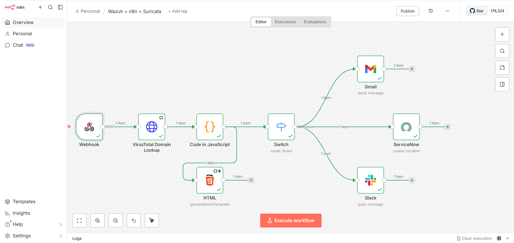
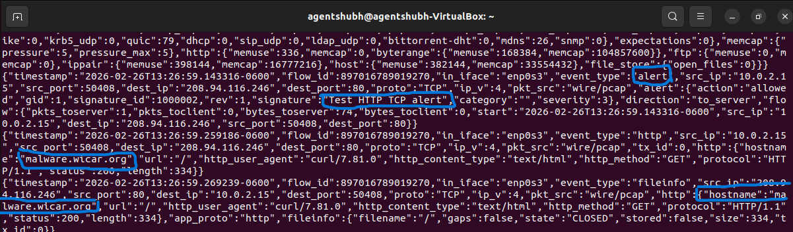
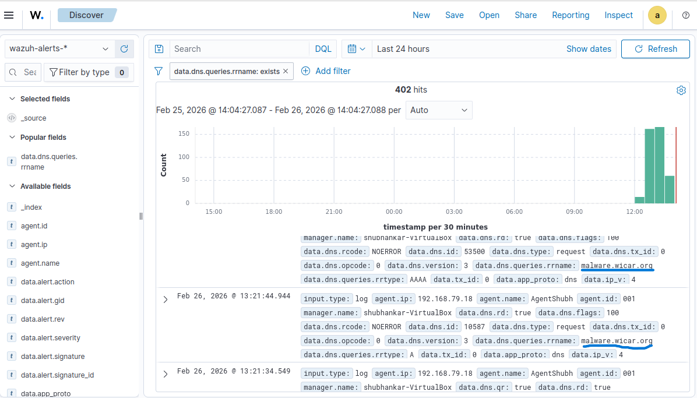
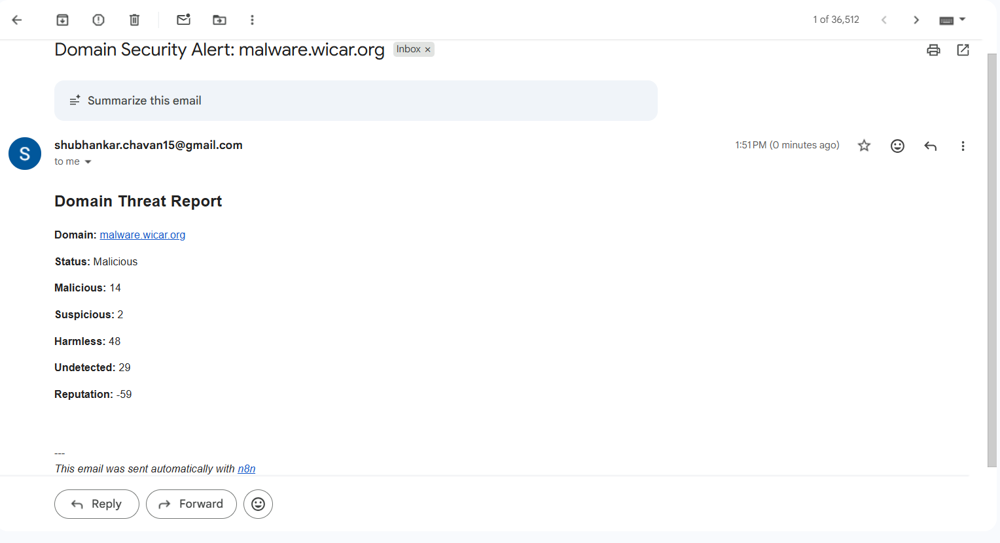
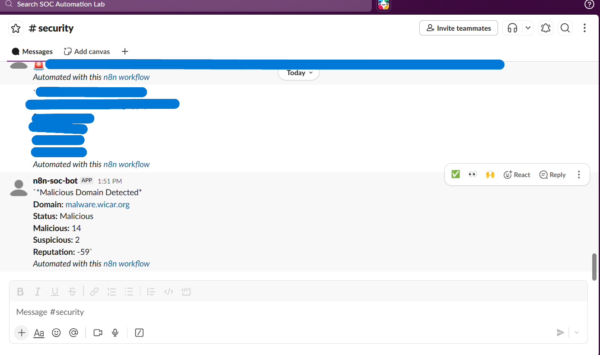
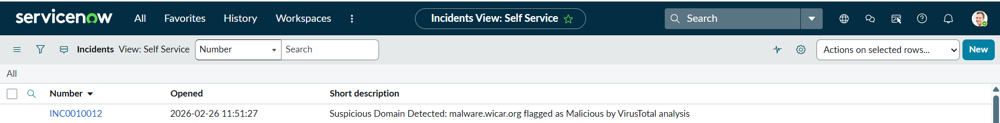

# Suricata-Wazuh-n8n-Automated-SOC-Alerting-Pipeline
The pipeline detects DNS queries via Suricata, logs them into Wazuh, enriches them using VirusTotal via n8n, and automatically escalates suspicious or malicious domains to Slack and ServiceNow.

---

## Project Overview

This project demonstrates a fully automated SOC workflow integrating:

- **Suricata** (Network IDS)

- **Wazuh** (SIEM & log management)

- **n8n** (Workflow automation)

- **VirusTotal** (Threat intelligence enrichment)

- **Slack** (SOC alerting)

- **Gmail** (SOC alerting)
  
- **ServiceNow** (Incident management)

---

## Task 1: Install & Configure Suricata IDS (Linux)
## Install Suricata
```
sudo add-apt-repository ppa:oisf/suricata-stable
sudo apt-get update
sudo apt-get install suricata -y
```

Get Emerging Threats rules
```
cd /tmp/ && curl -LO https://rules.emergingthreats.net/open/suricata-6.0.8/emerging.rules.tar.gz
sudo tar -xvzf emerging.rules.tar.gz
sudo mkdir -p /etc/suricata/rules
sudo mv rules/*.rules /etc/suricata/rules/
sudo chmod 640 /etc/suricata/rules/*.rules
```

Edit ```/etc/suricata/suricata.yaml:```
```
# Networks
HOME_NET: "<UBUNTU_IP>"
EXTERNAL_NET: "any"

# Rules
default-rule-path: /etc/suricata/rules
rule-files:
  - "*.rules"

# Linux high-speed capture
af-packet:
  - interface: enp0s3   # replace with your NIC (check with `ip a`)
```

Restart Suricata:
```
sudo systemctl restart suricata
```

## Task 2: Forward Suricata logs to Wazuh Agent
On the Linux endpoint, edit ```/var/ossec/etc/ossec.conf:```
```
<ossec_config>
  <localfile>
    <log_format>json</log_format>
    <location>/var/log/suricata/eve.json</location>
  </localfile>
</ossec_config>
```
Restart agent:
```
sudo systemctl restart wazuh-agent
```

## Task 3: Raise DNS/TLS events with Custom Wazuh Rules (Manager)
On the Wazuh manager, add a local rules file (e.g., ```/var/ossec/etc/rules/local_suricata_rules.xml```):
```
<group name="suricata,dns,tls">
  <rule id="100101" level="5">
    <if_sid>86603</if_sid>
    <field name="event_type">dns</field>
    <description>Suricata DNS Query Detected</description>
    <options>no_full_log</options>
  </rule>

  <rule id="100102" level="5">
    <if_sid>86604</if_sid>
    <field name="event_type">^tls$</field>
    <description>Suricata TLS Query Detected</description>
    <options>no_full_log</options>
  </rule>
</group>
```

Restart manager:
```
sudo systemctl restart wazuh-manager
```

## Task 4: Send DNS Alerts from Wazuh → n8n Webhook
In Wazuh manager configuration, add a custom integration entry (adapt to your file structure):
```
<integration>
  <name>custom-n8n</name>
  <hook_url>https://<your-n8n-host>/webhook/dns-linux</hook_url>
  <rule_id>100101</rule_id>          <!-- our DNS rule -->
  <alert_format>json</alert_format>
</integration>
```

 ***The webhook path (/webhook/dns-linux) should match the n8n Webhook node path you configure in the next step.***

## Task 5: Build the n8n Workflow 

## 5.1 Webhook Trigger (Entry)
- **Node type:** ```Webhook```
- **HTTP Method:**  ```POST```
- **Path:**  ```dns-linux``` (example)
- **Payload expectation:**  ```data.dns.rrname``` should contain the domain from Wazuh alert.
  
 **Purpose:**  Receives incoming Wazuh DNS alerts from Linux endpoints.

## 5.2 HTTP Request → VirusTotal (Domain Reputation)
- **Node type:**  ```HTTP Request```
- **Method:**  ```GET```

- **URL:** 
```
https://www.virustotal.com/api/v3/domains/{{$json.body.data.dns.rrname}}
```
- **Auth:**  VirusTotal API key (use n8n Credentials → Header ```x-apikey: <YOUR_KEY>``` or a VT credential).

- **Purpose:**  Pulls reputation and analysis stats for the queried domain.

## 5.3 Code → Build a Clean “summary” Object
- **Node type:**  ```Code``` (JavaScript)
- **Code:**
```
const data = items[0].json.data?.attributes;
const summary = {
  Domain: items[0].json.data?.id || 'N/A',
  Malicious: data?.last_analysis_stats?.malicious || 0,
  Suspicious: data?.last_analysis_stats?.suspicious || 0,
  Undetected: data?.last_analysis_stats?.undetected || 0,
  Harmless: data?.last_analysis_stats?.harmless || 0,
  Categories: Object.values(data?.categories || {}).join(', ') || 'None',
  Categories_HTML: Object.values(data?.categories || {})
    .map(cat => `<span class="tag">${String(cat).trim()}</span>`)
    .join(''),
  Reputation: data?.reputation || 0,
  Registrar: data?.registrar || 'Unknown',
  Registered_Date: data?.creation_date || 'Unknown',
  Expiry_Date: data?.expiration_date || 'Unknown',
  WHOIS_Server: data?.whois_server || 'Unknown',
  Last_Analysis_Date: new Date((data?.last_analysis_date || 0) * 1000)
    .toLocaleString('en-IN', { timeZone: 'Asia/Kolkata', dateStyle: 'short', timeStyle: 'medium' }),
  Generated_At: new Date().toLocaleString('en-IN', { timeZone: 'Asia/Kolkata', dateStyle: 'short', timeStyle: 'medium' }),
};

// Determine status
summary.Status = (summary.Malicious > 0 || summary.Suspicious > 0)
  ? 'Suspicious'
  : 'Safe';

return [{ json: { summary } }];
```
- **Purpose:** Normalizes VT response into a compact object used by all downstream nodes.

## 5.4 HTML → Nicely Formatted Report
- **Node type:** ```HTML```
- **Template** (use n8n expressions like ```{{$json.summary.*}}```):
```
<!DOCTYPE html>
<html lang="en">
<head>
  <meta charset="UTF-8" />
  <title>Domain Threat Summary</title>
  <style>
    body { font-family: "Segoe UI", sans-serif; background: #121212; color: #f0f0f0; padding: 20px; }
    .container { display: flex; gap: 20px; flex-wrap: wrap; }
    .card { background: #1e1e1e; border-radius: 12px; box-shadow: 0 4px 12px rgba(0,0,0,.6);
            padding: 20px; width: 100%; max-width: 500px; border: 1px solid #333; }
    h1 { color: #00bfff; }
    h2 { margin-top: 0; color: #4fc3f7; }
    .section-title { font-weight: bold; margin-top: 15px; color: #90caf9; }
    .label { font-weight: bold; color: #c5e1a5; }
    .tag { background: #333; color: #c5cae9; border-radius: 5px; padding: 2px 6px; margin: 2px 5px 2px 0; display: inline-block; }
    a { color: #81d4fa; text-decoration: none; }
    a:hover { text-decoration: underline; }
    .status { margin: 10px 0; font-weight: bold; padding: 8px 16px; border-radius: 8px; display: inline-block; }
    .safe { background: #2e7d32; color: #a5d6a7; }
    .suspicious { background: #c62828; color: #ffab91; }
  </style>
</head>
<body>
  <h1>Domain Threat Summary</h1>
  <p><span class="label">Domain:</span> {{$json.summary.Domain}}</p>

  <div class="status {{$json.summary.Status === 'Safe' ? 'safe' : 'suspicious'}}">
    {{$json.summary.Status}}
  </div>

  <div class="container">
    <div class="card">
      <h2>VirusTotal</h2>
      <p><span class="label">Reputation:</span> {{$json.summary.Reputation}}</p>
      <p><span class="label">Registrar:</span> {{$json.summary.Registrar}}</p>
      <p><span class="label">WHOIS Server:</span> {{$json.summary.WHOIS_Server}}</p>
      <p><span class="label">Registered:</span> {{$json.summary.Registered_Date}}</p>
      <p><span class="label">Expiry:</span> {{$json.summary.Expiry_Date}}</p>
      <p><span class="label">Categories:</span> {{$json.summary.Categories_HTML}}</p>
      <p class="section-title">Analysis Stats</p>
      <ul>
        <li>Harmless: {{$json.summary.Harmless}}</li>
        <li>Malicious: {{$json.summary.Malicious}}</li>
        <li>Suspicious: {{$json.summary.Suspicious}}</li>
        <li>Undetected: {{$json.summary.Undetected}}</li>
      </ul>
    </div>
  </div>

  <p style="margin-top:15px;">Generated at: {{$json.summary.Generated_At}}</p>
</body>
</html>
```
- **Purpose:** Produces a readable HTML email/report for analysts.

## 5.5 Switch → Conditional Routing
- **Node type:** ```Switch```
- **Condition:** ```{{$json.summary.Status}}``` equals ```Suspicious```
- **Logic:**
    - If **Suspicious** → continue to  **Gmail, ServiceNow & Slack**.
    - If **Safe** → No Notification
       
## 5.6 Gmail → Email Notification (Suspicious Only)
- **Node type:** ```Gmail```
- **To:** your SOC mailbox
- **Subject:** ```Security Alert```
- **Body:** Use output of the HTML node
- **Auth:** Gmail OAuth2 (n8n Credentials)

- **Purpose:** Sends detailed threat report to inbox.

## 5.7 ServiceNow → Create Incident (Suspicious Only)
- **Node type:** ```ServiceNow```
- **Resource:** ```Incident``` → Operation: ```Create```
- **Short description (example):**
```
A suspicious domain ({{$json.summary.Domain}}) was detected via DNS query
and flagged as {{$json.summary.Status}} by VirusTotal analysis. Immediate investigation is recommended.
```
- **Purpose:** Tracks suspicious domains in ITSM.

## 5.8 Slack → Team Notification (Suspicious Only)
- **Node type:** ```Slack```
- **Channel:** ```#n8n-trigger``` (or your security channel)

- **Message (example):**
```
Suspicious Domain Detected: {{$json.summary.Domain}}
Status: {{$json.summary.Status}}
Reputation: {{$json.summary.Reputation}}
```
- **Purpose:** Real-time team alerting.

## Task 6:End-to-End Flow (What Happens)
**1.** Suricata logs DNS/TLS events → Wazuh agent ships ```eve.json```.

**2.** Wazuh manager raises rules ```100101/100102``` → posts JSON to n8n Webhook.

**3.** n8n queries VirusTotal, builds summary, renders HTML.

**4.** Switch sends:

  - **Safe:** No Notification.
      
  - **Suspicious:** Gmail + ServiceNow incident + Slack alert.

---

## Screenshots
## 1. Architecture Overview


## 2. Suricata DNS Test Alert Generated


## 3. Wazuh DNS Alert Detected


## 4. Gmail Notification from n8n


## 5. Slack Alert Notification


## 6. ServiceNow Incident Created

       
